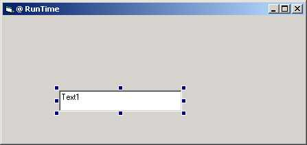

<div align="center">

## TiResize ActiveX Control


</div>

### Description

Resize controls in the same manner as the IDE at runtime
 
### More Info
 
I haven't tried it but can someone see if scroll bars cause problems?


<span>             |<span>
---                |---
**Submitted On**   |2002-10-20 03:23:44
**By**             |[Stuart Naylor](https://github.com/Planet-Source-Code/PSCIndex/blob/master/ByAuthor/stuart-naylor.md)
**Level**          |Advanced
**User Rating**    |5.0 (30 globes from 6 users)
**Compatibility**  |VB 5\.0, VB 6\.0
**Category**       |[Custom Controls/ Forms/  Menus](https://github.com/Planet-Source-Code/PSCIndex/blob/master/ByCategory/custom-controls-forms-menus__1-4.md)
**World**          |[Visual Basic](https://github.com/Planet-Source-Code/PSCIndex/blob/master/ByWorld/visual-basic.md)
**Archive File**   |[TiResize\_A14843710202002\.zip](https://github.com/Planet-Source-Code/stuart-naylor-tiresize-activex-control__1-39985/archive/master.zip)

### API Declarations

```
Public Declare Function ReleaseCapture Lib "user32" () As Long
Public Declare Function SendMessage Lib "user32" Alias "SendMessageA" (ByVal hWnd As Long, _
 ByVal wMsg As Long, ByVal wParam As Long, lParam As Any) As Long
  'API Declarations used for subclassing.
  Public Declare Sub CopyMemory _
   Lib "kernel32" Alias "RtlMoveMemory" _
   (pDest As Any, _
   pSrc As Any, _
   ByVal ByteLen As Long)
  Public Declare Function SetWindowLong _
   Lib "user32" Alias "SetWindowLongA" _
   (ByVal hWnd As Long, _
   ByVal nIndex As Long, _
   ByVal dwNewLong As Long) As Long
  Public Declare Function GetWindowLong _
   Lib "user32" Alias "GetWindowLongA" _
   (ByVal hWnd As Long, _
   ByVal nIndex As Long) As Long
  Public Declare Function CallWindowProc _
   Lib "user32" Alias "CallWindowProcA" _
   (ByVal lpPrevWndFunc As Long, _
   ByVal hWnd As Long, _
   ByVal Msg As Long, _
   ByVal wParam As Long, _
   ByVal lParam As Long) As Long
  Public Declare Function ChildWindowFromPoint _
   Lib "user32" (ByVal hWnd As Long, ByVal xPoint As Long, _
   ByVal yPoint As Long) As Long
```


